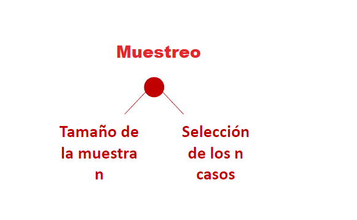
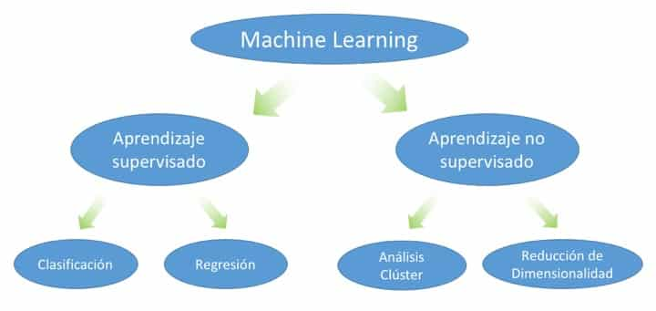
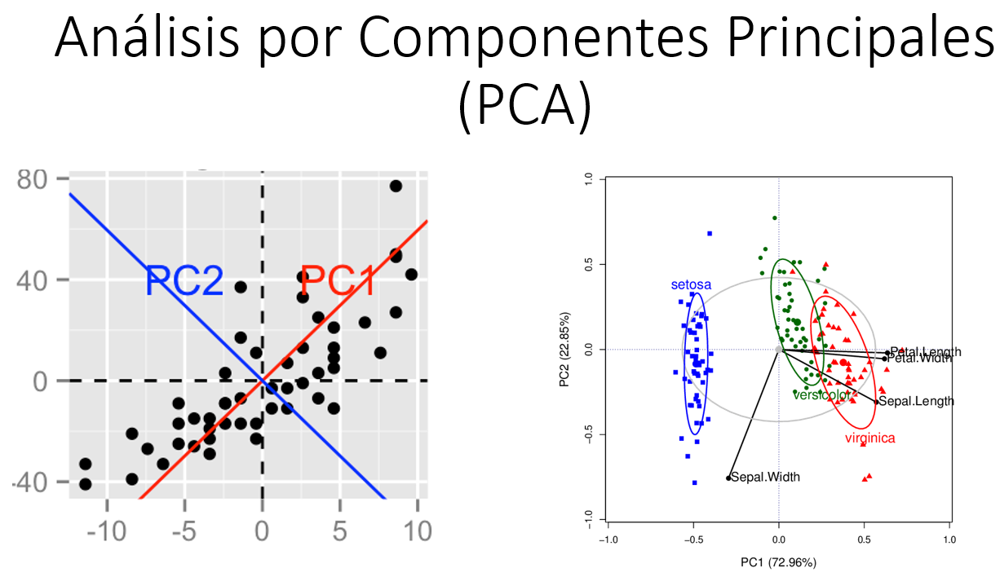
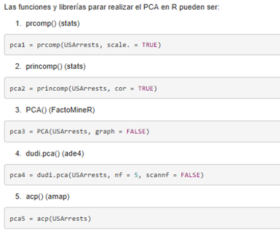
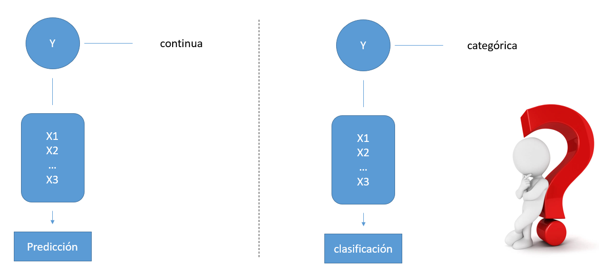
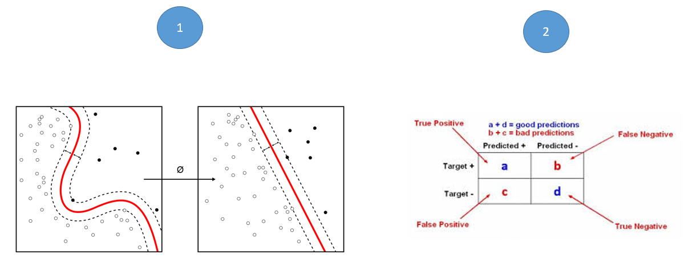
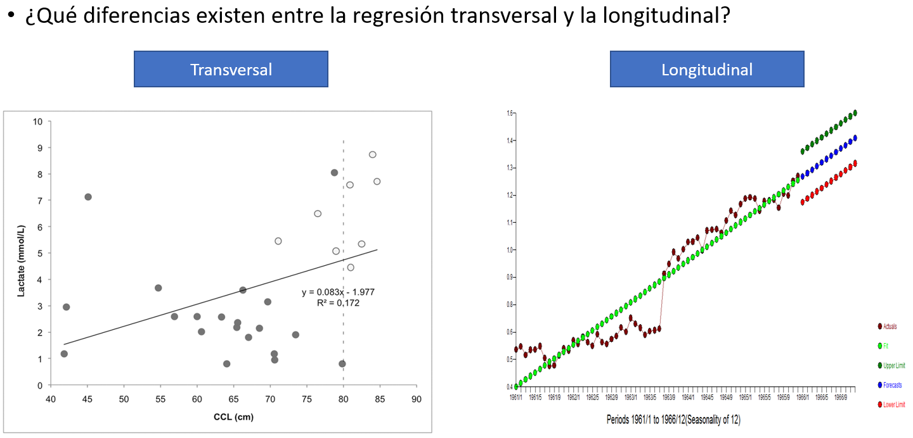
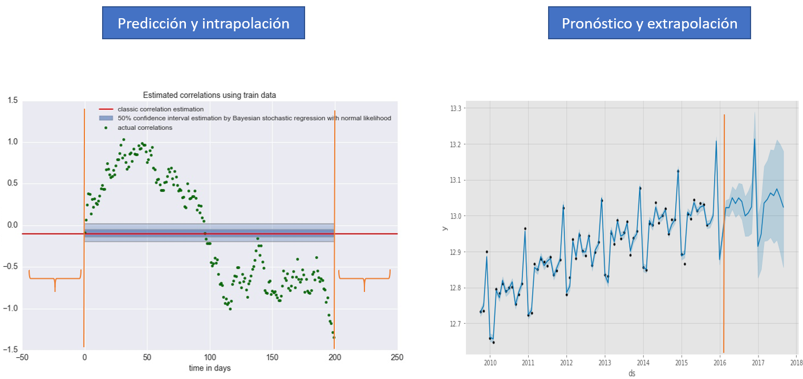

```{r setup, include=FALSE}
knitr::opts_chunk$set(echo = TRUE)

suppressWarnings(library(magrittr))
suppressWarnings(library(dplyr))
suppressWarnings(library(readxl))
suppressWarnings(library(tidyr))
suppressWarnings(library(DT))

suppressWarnings(library(magrittr)) 
suppressWarnings(library(dplyr))   
suppressWarnings(library(stats))
suppressWarnings(library(FactoMineR))
suppressWarnings(library(ade4))
suppressWarnings(library(amap))
suppressWarnings(library(ggplot2))
suppressWarnings(library(factoextra))

suppressWarnings(library(FactoMineR))
suppressWarnings(library(factoextra))
#library("grid")
suppressWarnings(library(REdaS))
suppressWarnings(library(corpcor))
suppressWarnings(library(GPArotation))
suppressWarnings(library(psych))
suppressWarnings(library(ggplot2))
suppressWarnings(library(MASS))
suppressWarnings(library(GGally))
suppressWarnings(library(corrplot))
suppressWarnings(library(Hmisc))
suppressWarnings(library(psych))
suppressWarnings(library(corrplot))
suppressWarnings(library(nFactors))

suppressWarnings(library(mclust))
suppressWarnings(library(reshape2))
suppressWarnings(library(MVN))
suppressWarnings(library(stats))
suppressWarnings(library(cluster))
suppressWarnings(library(mclust))
suppressWarnings(library(dendextend))
suppressWarnings(library(igraph))
suppressWarnings(library(ape))
suppressWarnings(library(NbClust))
suppressWarnings(library(factoextra))
suppressWarnings(library(ggpubr))
suppressWarnings(library(purrr))
suppressWarnings(library(clustertend))
suppressWarnings(library(fpc))
suppressWarnings(library(pheatmap))
suppressWarnings(library(dendextend))
suppressWarnings(library(clValid))
suppressWarnings(library(klaR))
suppressWarnings(library(boot))
suppressWarnings(library(broom))
suppressWarnings(library(forecast))
suppressWarnings(library(tseries))
suppressWarnings(library(ggfortify))


personality <- read.csv("personality0.txt", sep="")
attach(personality)

personality = as.data.frame(scale(personality))

data(wine)
colnames(wine)

wine.1 <- wine[,-c(1,2)]
colnames(wine.1)


```

<style>
table {
background-color:#FFFFFF;
}
</style>

<style>
.list-group-item.active, .list-group-item.active:focus, .list-group-item.active:hover {
    background-color: darkblue;
}
</style>

<button onclick="document.body.scrollTop = document.documentElement.scrollTop = 0;" style="
    position: fixed;
    bottom: 5px;
    right: 40px;
    text-align: center;
    cursor: pointer;
    outline: none;
    color: #fff;
    background-color: #0A71A0;
    border: none;
    border-radius: 15px;
    
">Ir arriba</button>

# Métodos de análisis en R


El presente tema presenta algunos métodos de análisis en R. 

Los temas cubiertos serán:

- Muestreo.
- Componentes principales.
- Análisis de Factores.
- Agrupamiento (cluster).
- Discriminante. 
- Regresión.
- Regresión dicotómica.
- Series temporales.

Al finalizar la sesión usted tendrá una *noción* de una gama de análisis que se pueden realizar en R, esperando que incentive a la persona a seguir buscando otras formas, métodos y técnicas de análisis de la información.

# 1. Métodos de muestreo: selección de una muestra.

## ¿Qué es el muestreo?

El muestreo es el proceso de seleccionar un conjunto de individuos de una población con el fin de estudiarlos y poder caracterizar el total de la población. Dada la imposibilidad de estudiar o análisis a una población entera (censar), debemos pasar el una muestreo, o por el método de muestreo. 

El muestreo se constituye de dos partes:



No sé cubrirá el tamaño de muestre (n), y sus distintos diseños (aleatorio, sistemático, estratificado, conglomerado o complejo, etc) pero veremos dos formas de seleccionar casos en R.

## Muestra Aleatoria

Podemos tomar una muestra de tamaño **n** mediante la función *"sample_n"*. Tomemos una muestra de tamaño 50.

```{r}
dim(iris)

n <- iris %>% sample_n(50,replace=FALSE)
dim(n)
```

## Muestra según fracción de la población

También podemos seleccionar de forma aleatoria las observaciones pero de forma relativo o por una proporción. 

Utilizamos la función *"sample_frac"*. Tomemos un 10% de la población.

```{r}
dim(iris)

n2 <- iris %>% sample_frac(0.1,replace=FALSE)
dim(n2)
```

## Otras funciones

R posee dos librerías las siguientes librerías para tratar los temas de muestreo:

- **sampling**
- **survey**

Mientras que *sampling* trabaja diseños aleatorios irrestrictos, sistemáticos y jerárquicos, *survey* se utiliza para diseños complejos o por conglomerados. 

# Tipo de análisis - NS.

Abordamos dos tipos de enfoque: 

- Aprendizaje no supervisado y
- Aprendizaje supervisado.



Antes: 

- ¿Qué es Machine Learning?
- ¿Cuál es la diferencia entre el Machine Learing y los métodos de Estadística?

Una definición de la web explica:

*Aprendizaje no supervisado es un método donde un modelo se ajusta a las observaciones. Se distingue del Aprendizaje supervisado por el hecho de que no hay un conocimiento a priori. En el aprendizaje no supervisado, un conjunto de datos de objetos de entrada es tratado.*

En mis palabras, diría:

- En el aprendizaje no supervisado, todas las variables tienen la misma relación entre ellas (relación simétrica). Ninguna busca explicar la relación o el comportamiento de las otras. Todas tienen el mismo nivel de explicación.
- En el aprendizaje supervisado una variable trata de ser explicada por las demás (relación asimétrica). Acá es donde se suele hablar de variable(s) dependiente(s) y variable(s) independiente(s).

Empecemos primero los análisis de *aprendizaje no supervisado*.

# 2. Análisis por Componentes Principales.



El análisis por componente principales hace parte de un grupo de análisis descriptivos multidimensionales llamados métodos factoriales.

Son métodos descriptivos, no se apoyan en modelos probabilísticos sino más bien de un modelo geométrico para mejorar la representación multidimencional.

A partir de una matriz rectangular de datos con *p* variables cuantitativas y *n* unidades, el análisis por componentes principales propone diversas representación geométricas para el entendimiento de los individuos y las variables.

Lo que se busca es ver si existe una estructura, no conocida a priori, para el conjunto de casos y variables, y así mejorar la interpretación. 

Como todo método descriptivo, llevar a cabo un PCA no es un fin en sí. El PCA sirve para conocer mejor los datos, detectar valores sospechosos, y ayuda a formular hipótesis que se deben estudiar luego mediante modelos predictivos. 

Para la aplicación del PCA en R, se pueden utilizar diversas librerías y funciones. Se exponen algunos ejemplos:



Veamos la estrucuta de las salidas del análisis por PCA.

```{r echo=FALSE, error=FALSE ,message=FALSE, warning=FALSE}

decathlon2.active <- decathlon2[1:23, 1:10]

res.pca <- prcomp(decathlon2.active, scale = TRUE)

eig.val <- get_eigenvalue(res.pca)


```


## Variancia explicada {.tabset .tabset-fade}

### Porcentaje de la variancia explicada

Veamos el porcentaje de variancia explicada por componente

Proporció de la varianza explicada

```{r echo=FALSE, error=FALSE ,message=FALSE, warning=FALSE, results='hide'}
prop_varianza <- res.pca$sdev^2 / sum(res.pca$sdev^2)
prop_varianza*100

ggplot(data = data.frame(prop_varianza, pc = 1:10),
       aes(x = pc, y = prop_varianza)) +
  geom_col(width = 0.3) +
  scale_y_continuous(limits = c(0,1)) +
  theme_bw() +
  labs(x = "Componente principal",
       y = "Prop. de varianza explicada")
```

Proporció de la varianza explicada acumulada


```{r echo=FALSE, error=FALSE ,message=FALSE, warning=FALSE}
prop_varianza_acum <- cumsum(prop_varianza)

ggplot(data = data.frame(prop_varianza_acum, pc = 1:10),
       aes(x = pc, y = prop_varianza_acum, group = 1)) +
  geom_point() +
  geom_line() +
  theme_bw() +
  labs(x = "Componente principal",
       y = "Prop. varianza explicada acumulada")
```


### Gráfico de sedimentación

```{r echo=FALSE, error=FALSE ,message=FALSE, warning=FALSE}
fviz_eig(res.pca)
```

## Proyecciones {.tabset .tabset-fade}

El PCA busca mediante proyección explicar a:

- Las observaciones o individuos.
- Las variables. 
- La conjunción de observaciones-variables.

### Individuos

Proyección de los individuos

```{r echo=FALSE, error=FALSE ,message=FALSE, warning=FALSE}
data(decathlon2)
decathlon2.active <- decathlon2[1:23, 1:10]

res.pca <- prcomp(decathlon2.active, scale = TRUE)

fviz_pca_ind(res.pca,
             col.ind = "cos2", # Color by the quality of representation
             gradient.cols = c("#00AFBB", "#E7B800", "#FC4E07"),
             repel = TRUE     # Avoid text overlapping
             )

```

### Variables

Proyección de las variables

```{r echo=FALSE, error=FALSE ,message=FALSE, warning=FALSE}
fviz_pca_var(res.pca,
             col.var = "contrib", # Color by contributions to the PC
             gradient.cols = c("#00AFBB", "#E7B800", "#FC4E07"),
             repel = TRUE     # Avoid text overlapping
             )

```

### Individuos - Variables

Proyección de individuos y variables

```{r echo=FALSE, error=FALSE ,message=FALSE, warning=FALSE}
fviz_pca_biplot(res.pca, repel = TRUE,
                col.var = "#2E9FDF", # Variables color
                col.ind = "#696969"  # Individuals color
                )
```


# 3. Análisis de factores.

En el AF la atención se centra principalmente en las variables estadísticas y no en los individuos; es más un método de *análisis multivariante* que un método de *análisis multidimensional*. 

El Análisis Factorial es un nombre genérico que se da a una clase de métodos estadísticos multivariantes cuyo propósito principal es definir la estructura subyacente en una matriz de datos. Generalmente hablando, aborda el problema de cómo analizar la estructura de las interrelaciones (correlaciones) entre un gran número de variables.

Al igual que el PCA, en el AF se busca reducir un número *p* a *k* variables. Sin embargo, el AF posee ciertas características que lo hacen el análisis ideal para conocer las estructura subyacente que se desea estudiar.  Se dice que el AF es más elaborado, y se buscan conclusiones más contundentes, el PCA busca más aproximaciones a nivel gráfico del conjunto de datos. A esa reducción les llamamos Factores. 

De forma matemática, el **PCA** es un **AF** pero más simple: sin extracción de vector propio, sin rotaciones, y sin transformaciones, además del gran supuesto practicamente irreal de la ortogonalidad de las variables o componentes principales en el PCA.

Desde un punto de vista práctico, el PCA es observacional, y el AF es un enfoque para un modelo explicito (estructura subyacente).

Mientras que el PCA busca el análisis de la variancia, el AF además busca el análisis de la covariancia y correlación entre las variables.

El objetivo típico en el análisis factorial es identificar las variables que están relacionadas entre sí, y separarlas de otras (una forma de agrupación de las variable). Los tipos de rotaciones ayudan a visualizar mejor este proceso. 

Existen dos grandes tipos de modalidaes para el FA: 

- Análisis Factorial Exploratorio.
- Análisis Factorial Confirmatorio.


```{r echo=FALSE, error=FALSE ,message=FALSE, warning=FALSE}
wine.1 <- wine[,-c(1,2)]

```


```{r echo=FALSE, error=FALSE ,message=FALSE, warning=FALSE}

personality <- read.csv("personality0.txt", sep="")

attach(personality)

personality = as.data.frame(scale(personality))

```


```{r echo=FALSE, error=FALSE ,message=FALSE, warning=FALSE}

 res.mfa <- MFA(wine, 
               group = c(2, 5, 3, 10, 9, 2), 
               type = c("n", "s", "s", "s", "s", "s"),
               name.group = c("origin","odor","visual",
                              "odor.after.shaking", "taste","overall"),
               num.group.sup = c(1, 6),
               graph = FALSE)

```


```{r echo=FALSE, error=FALSE ,message=FALSE, warning=FALSE}
fa.0 <- fa(r=wine.1, nfactors = 10, rotate = "none")
```


```{r echo=FALSE, error=FALSE ,message=FALSE, warning=FALSE}
res1b <- factanal(personality, factors = 10, rotation = "none", na.action = na.omit)
#Las diversas funciones del análisis de factores:
```

Veamos unos usos del FA exploratorio.

## Cantidad de Factores {.tabset .tabset-fade}

### Gráfico de sedimentación (Scree plot)

#### Opción 1

La forma más popular de conocer la cantidad óptima de factores es mediante el gráfico de sedimentación. Lo usual es ver dónde es que se lleva a cabo la caída más
importante, o se dibuja un "codo". A veces no es nada fácil el saber lo anterior. Personalmente considero que ante la poca claridad, hay que llevar a cabo un análisis
interactivo del FA.

```{r echo=FALSE, error=FALSE ,message=FALSE, warning=FALSE}
fviz_screeplot(res.mfa)
```

¿Cuántos factores?

#### Opción 2

R posee ciertos criterios que permiten "guiar" al analista en la elección del número de factor a elegir.

```{r echo=FALSE, error=FALSE ,message=FALSE, warning=FALSE}

corpdat1 <- cor(wine.1, use="pairwise.complete.obs")

fa.parallel(x=corpdat1, fm="minres", fa="fa")

nScree(x=corpdat1,model="factors")
plot(nScree(x=corpdat1,model="factors"))
```

Entonces, ¿cuántos componentes debemos elegir? 


```{r error=FALSE ,message=FALSE, warning=FALSE, echo=TRUE}
fa.1 <- fa(r=wine.1, nfactors = 3, rotate = "varimax")

res1a <- factanal(personality, factors = 5, rotation = "varimax", na.action = na.omit)
fa.0 <- fa(r=personality, nfactors = 5, rotate = "varimax")
res1a <- factanal(personality, factors = 5, rotation = "varimax", na.action = na.omit)
res1a <- factanal(personality, factors = 5, rotation = "varimax", na.action = na.omit)
res1a <- factanal(personality, factors = 5, rotation = "varimax", na.action = na.omit)
```


```{r error=FALSE ,message=FALSE, warning=FALSE} 

# Calculadon la  singularidad  y la comunalidad

loadings_distant = res1a$loadings[1,]
communality_distant = sum(loadings_distant^2); communality_distant


uniqueness_distant = 1-communality_distant; uniqueness_distant
```


## Verificación de resultados {.tabset .tabset-fade}

### Contribuciones

Veamos el peso de cada variable a los Factores

Factor 1

```{r echo=FALSE, error=FALSE ,message=FALSE, warning=FALSE}
fviz_contrib(res.mfa, choice = "quanti.var", axes = 1, top = 20,
             palette = "jco")
```

Factor 2

```{r echo=FALSE, error=FALSE ,message=FALSE, warning=FALSE}
fviz_contrib(res.mfa, choice = "quanti.var", axes = 2, top = 20,
             palette = "jco")
```

Factor 3

```{r echo=FALSE, error=FALSE ,message=FALSE, warning=FALSE}
fviz_contrib(res.mfa, choice = "quanti.var", axes = 3, top = 20,
             palette = "jco")
```

### Reporte del FA

Según la cantidad de factores, la función fa.diagram nos puede indicar cuál es la estructura factorial del análisis.

```{r echo=FALSE, error=FALSE ,message=FALSE, warning=FALSE}
fa.1 <- fa(r=wine.1, nfactors = 3, rotate = "varimax")

fa.diagram(fa.1)
```


### Factores en plano 2D

LLevado a cabo el proceso de elegir la rotación y luego el número de componentes, podemos verificar que desde un inicio hasta la solución del problema, la estructura factorial 
del FA posee una forma de explicar los facores en un plano 2D. Veamos esto

Inicio: todas las variables

```{r echo=FALSE, error=FALSE ,message=FALSE, warning=FALSE}
res1b <- factanal(personality, factors = 10, rotation = "none", na.action = na.omit)

load = res1b$loadings[,1:2]
plot(load, type="n") 
text(load,labels=names(personality),cex=.7)
```

Intermedio: aplicación del FA y el acomodo de las variables

```{r echo=FALSE, error=FALSE ,message=FALSE, warning=FALSE}

res1a <- factanal(personality, factors = 5, rotation = "varimax", na.action = na.omit)

load <- res1a$loadings[,1:2]
plot(load, type="n") # set up plot 
text(load,labels=names(personality),cex=.7) # agregando el nombre de las variables

```

Final: estructura final del FA

Creamos la estructura factorial mediante el análisis de las cargas factoriales

```{r }
shy = rowMeans(cbind(personality$distant, personality$shy, personality$withdrw, personality$quiet))
outgoing = rowMeans(cbind(personality$talkatv, personality$outgoin, personality$sociabl))
hardworking = rowMeans(cbind(personality$hardwrk, personality$persevr, personality$discipl))
friendly = rowMeans(cbind(personality$friendl, personality$kind, personality$coopera, personality$agreebl, personality$approvn, personality$sociabl))
anxious = rowMeans(cbind(personality$tense, personality$anxious, personality$worryin))

# Combinando los factores y creando una nueva estructura de datos
combined_data = cbind(shy,outgoing,hardworking,friendly,anxious)
combined_data = as.data.frame(combined_data)
```

```{r echo=FALSE, error=FALSE ,message=FALSE, warning=FALSE}

res2 <- factanal(combined_data, factors = 2, na.action=na.omit)

load <- res2$loadings[,1:2]
plot(load, type="n") # set up plot 
text(load,labels=names(combined_data),cex=.7) # agregando el nombre de las variables

```

Puede que acá se estimen diversos modelos de FA, con diversas rotaciones, con tal de ver una mejorar separación, y hasta aglomeración de los factores. 


# 4. Análisis de correspondencia.

Es una técnica descriptiva o exploratoria cuyo objetivo es resumir una gran cantidad de datos en un número reducido de dimensiones, con la menor pérdida de información posible. En esta línea, su objetivo es similar al de los métodos factoriales, salvo que en el caso del análisis de correspondencias el método se aplica sobre variables categóricas (nominales y ordinales).

El análisis de correspondencias simples se utiliza a menudo en la representación de datos que se pueden presentar en forma de tablas de contingencia de dos variables nominales u ordinales. Otras utilizaciones implican el tratamiento de tablas de proximidad o distancia entre elementos, y tablas de preferencias.

El análisis de correspondencias consiste en resumir la información presente en las filas y columnas de manera que pueda proyectarse sobre un subespacio reducido, y representarse simultáneamente los puntos fila y los puntos columna, pudiéndose obtener conclusiones sobre relaciones entre las dos variables nominales u ordinales de origen.

La extensión del análisis de correspondencias simples al caso de varias variables nominales (tablas de contingencia multidimensionales) se denomina Análisis de Correspondencias Múltiples, y utiliza los mismos principios generales que la técnica anterior. En general se orienta a casos en los cuales una variable representa ítems o individuos y el resto son variables cualitativas u ordinales que representan cualidades.

## Librerías

## Ejemplo de un CA simple

```{r}

housetasks
```

```{r}
res.ca <- CA(housetasks, graph = FALSE)
get_ca_row(res.ca)
get_ca_col(res.ca)
```

```{r}
#--- para las filas:
fviz_contrib(res.ca, choice = "row", axes = 1)
```
```{r}
#--- para las columnas:
fviz_contrib(res.ca, choice = "col", axes = 1)
```

```{r}
#--- para las variables en las filas:
fviz_ca_row(res.ca, repel = TRUE)
```

```{r}
#--- para las variables en las columnas:
fviz_ca_col(res.ca)
```

```{r}
#--- y la visualización conjunta:
fviz_ca_biplot(res.ca, repel = TRUE)
```


# 5. Análisis de agrupación o Cluster Analysis. 

El Análisis por Conglomerados (Cluster Analysis), es una técnica estadística multivariante que agrupa elementos (sujetos) tratando de lograr la máxima homogeneidad en cada grupo y la mayor diferencia entre los grupos.

Es un método basado en criterios geométricos y se utiliza fundamentalmente como una técnica exploratoria, descriptiva pero no explicativa. Se fundamenta en teorías de optimizaciones numéricas, y no en optimizaciones algebraicas. 

Las soluciones no son únicas, en la medida en que la pertenencia al conglomerado para cualquier número de soluciones depende de muchos elementos del procedimiento elegido.

La solución del Cluster depende totalmente de las variables utilizadas, la adición o destrucción de variables relevantes puede tener un impacto substancial sobre la solución resultante.

Los algoritmos de formación de conglomerados se agrupan en diversas categorías, y existen muchas modalidades. El presente capítulo estudia los modalidades de clusters jerárquicos y los de k-medias.

El objetivo del análisis de cluster es, a partir de *“𝑛”* individuos (𝑛 grupos  iniciales) buscar agrupar el conjunto de individios en dos o más grupos basados en la similitud de esos objetos según una serie especificada de características (variables).

Finalmente, siempre hay que tomar en cuenta los mismos tres aspectos que podrían influir fuertemente en el análisis de los datos:

- Valores extremos
- Medición de la similitud
- Estandarización de los datos

Veremos algunos ejemplos de los algoritmos presentados. 

## Funciones y librerías del cluster analysis

En el entorno de programación R existen múltiples paquetes que implementan algoritmos de clustering y funciones para visualizar sus resultados. En este documento se emplean los siguientes:

stats: contiene las funciones:

- dist() para calcular matrices de distancias
- kmeans() 
- hclust()  
- cuttree() para crear los clusters y
- plot.hclust() para visualizar los resultados.
- luster 
- mclust: contienen múltiples algoritmos de clustering y métricas para evaluarlos.
- factoextra: extensión basada en ggplot2 para crear visualizaciones de los resultados de clustering y su evaluación.
- dendextend: extensión para la customización de dendrogramas. 

Para evitar problemas de la magnitud de las variables, recordar **SIEMPRE** escalar las variables...

Veamos la estructura de algunas de funciones anteriores:

### scale

La estructura es :

```{r}
#scale(x, center = TRUE, scale = TRUE)
```


### kmeans

La estructura es :

```{r}
#kMeans(x, centers, iter.max=10, num.seeds=10)
```

### fviz_cluster

La estructura es :

```{r}
# fviz_cluster(object, data = NULL, choose.vars = NULL, stand = TRUE,
#  axes = c(1, 2), geom = c("point", "text"), repel = FALSE,
#  show.clust.cent = TRUE, ellipse = TRUE, ellipse.type = "convex",
#  ellipse.level = 0.95, ellipse.alpha = 0.2, shape = NULL,
#  pointsize = 1.5, labelsize = 12, main = "Cluster plot", xlab = NULL,
#  ylab = NULL, outlier.color = "black", outlier.shape = 19,
#  ggtheme = theme_grey(), ...)
```


### hclust

La estructura es :

```{r}
# hclust(d, method = "complete", members = NULL)
# S3 method for hclust
# plot(x, labels = NULL, hang = 0.1, check = TRUE,
#      axes = TRUE, frame.plot = FALSE, ann = TRUE,
#      main = "Cluster Dendrogram",
#      sub = NULL, xlab = NULL, ylab = "Height", …)
```

## Cluster por k medias

El set de datos USArrests contiene información sobre el número de delitos (asaltos, asesinatos y secuestros) junto con el porcentaje de población urbana para cada uno de los 50 estados de USA. Se pretende estudiar si existe una agrupación subyacente de los estados empleando K-means-clustering.

El paquete factoextra creado contiene funciones que facilitan en gran medida la visualización y evaluación de los resultados de clustering. Si se emplea K-means-clustering con distancia euclídea hay que asegurarse de que las variables empleadas son de tipo continuo, ya que trabaja con la media de cada una de ellas.

Veamos una representación de los datos, para 4 clusters (K=4)

```{r echo=TRUE,error=FALSE ,message=FALSE, warning=FALSE}
datos <- scale(USArrests)

set.seed(123)
km_clusters <- kmeans(x = datos, centers = 4, nstart = 50)

# Las funciones del paquete factoextra emplean el nombre de las filas del
# dataframe que contiene los datos como identificador de las observaciones.
# Esto permite añadir labels a los gráficos.
fviz_cluster(object = km_clusters, data = datos, show.clust.cent = TRUE,
             ellipse.type = "euclid", star.plot = TRUE, repel = TRUE) +
  labs(title = "Resultados clustering K-means") +
  theme_bw() +
  theme(legend.position = "none")
```

## Clusters jerárquicos

Hierarchical clustering es una alternativa a los métodos de partitioning clustering que no requiere que se pre-especifique el número de clusters. Los métodos que engloba el hierarchical clustering se subdividen en dos tipos dependiendo de la estrategia seguida para crear los grupos:

Agglomerative clustering (bottom-up): el agrupamiento se inicia en la base del árbol, donde cada observación forma un cluster individual. Los clusters se van combinado a medida que la estructura crece hasta converger en una única “rama” central.

Divisive clustering (top-down): es la estrategia opuesta al agglomerative clustering, se inicia con todas las observaciones contenidas en un mismo cluster y se suceden divisiones hasta que cada observación forma un cluster individual.

En ambos casos, los resultados pueden representarse de forma muy intuitiva en una estructura de árbol llamada dendrograma. 

En este se debe antes transformar los datos a distancias

```{r error=FALSE ,message=FALSE, warning=FALSE}


# Crear las distancia y definir el método 
dd <- dist(scale(USArrests), method = "euclidean")
hc <- hclust(dd, method = "ward.D2")
```

Veamos diversas modalidaes 

### Tipos de clusters jerárquicos

Referencia: http://www.sthda.com/english/wiki/beautiful-dendrogram-visualizations-in-r-5-must-known-methods-unsupervised-machine-learning 

Mediante el plot.hclust(), el más sencillo 

```{r}
plot(hc)
# Put the labels at the same height: hang = -1
plot(hc, hang = -1, cex = 0.6)

```

Mediante el plot.dendogram(),

```{r}
# Convert hclust into a dendrogram and plot
hcd <- as.dendrogram(hc)
# Default plot
plot(hcd, type = "rectangle", ylab = "Height")
# Zoom in to the first dendrogram
plot(hcd, xlim = c(1, 20), ylim = c(1,8))
# Triangle plot
plot(hcd, type = "triangle", ylab = "Height")


```

Mediante el Phylogenetic trees

Este presenta diversas formas de representar los clusters

```{r}
# Default plot
plot(as.phylo(hc), cex = 0.6, label.offset = 0.5)
# Cladogram
plot(as.phylo(hc), type = "cladogram", cex = 0.6, 
     label.offset = 0.5)
# Unrooted
plot(as.phylo(hc), type = "unrooted", cex = 0.6,
     no.margin = TRUE)
# Fan
plot(as.phylo(hc), type = "fan")
# Radial
plot(as.phylo(hc), type = "radial")

# Change the appearance
# change edge and label (tip)
plot(as.phylo(hc), type = "cladogram", cex = 0.6,
     edge.color = "steelblue", edge.width = 2, edge.lty = 2,
     tip.color = "steelblue")
```


# Tipo de análisis - S.

Ahora pasemos a los análisis supervisados.

En el aprendizaje supervisado una variable trata de ser explicada por las demás (relación asimétrica, variables dependientes e independientes).


# Clasificación  / análisis discriminante.    

La clasificación se centra en identificar a cuál de un conjunto de categorías (subpoblaciones) pertenece una nueva observación, sobre la base de un conjunto de datos de formación que contiene observaciones (o instancias) cuya categoría de miembros es conocida.

En el análisis de aprendizaje automático, para datos transversales, existen dos grandes categorias: la clasificación y la predicción.



Por ahora veremos la clasificación, luego en la regresión veremos la predicción, y volveremos a ver la clasifiación cuando vemos la regresión dicotómica. 

# 6. Análisis discriminante

El análisis discriminante es una técnica multivariante cuya finalidad es describir las diferencias significativas entre *𝑘* grupos de objetos (𝑘 > 1) sobre los que se observan (variable de clasificación).

En caso de que estas diferencias existan, intentará explicar en qué sentido se dan y proporcionar procedimientos de asignación sistemática de nuevas observaciones con grupo desconocido a uno de los grupos analizados, utilizando para ello sus valores en las𝑘variables clasificadoras.

Podemos ver este procedimiento como un modelo de predicción de una variable respuesta categórica (variable grupo) a partir de *𝑘* variables explicativas generalmente continuas (variables clasificatorias).

El Análisis Discriminante consiste en buscar nuevas variables (variables discriminantes), que separan lo mejor posible los grupos de proyección en las 𝑘 variables, de las 𝑛 observaciones, para poder predecir nuevas observaciones *i*.

En la clasificación se llevan a cado dos procesos fundamentales: construir la regla o ecuación de  clasificación, y verificar la calidad del proceso, para luego introducir nuevos casos.. 



En la construcción de la regla de decisión, veremos un forma lineal y otro cuadrática.

## Librerías y funciones

Utilizaremos dos funciones lda() y qda() de la librería MASS.

### lda() (MASS)

La estructura es :

```{r eval=FALSE}
 lda(x, …)
  S3 method for formula
 lda(formula, data, …, subset, na.action)

 S3 method for default
 lda(x, grouping, prior = proportions, tol = 1.0e-4,
    method, CV = FALSE, nu, …)

 S3 method for data.frame
 lda(x, …)

  S3 method for matrix
  lda(x, grouping, …, subset, na.action)
```


Ver el enlace: https://www.rdocumentation.org/packages/MASS/versions/7.3-51.1/topics/lda


### qda()

La estructura es :

```{r eval=FALSE}
qda(x, …)
S3 method for formula
qda(formula, data, …, subset, na.action)

S3 method for default
qda(x, grouping, prior = proportions,
   method, CV = FALSE, nu, …)

S3 method for data.frame
qda(x, …)

S3 method for matrix
qda(x, grouping, …, subset, na.action)
```

Ver el enlace: https://www.rdocumentation.org/packages/MASS/versions/7.3-51.1/topics/qda

## Partición del archivo de datos

Pera evaluar la regla de decisión, se suele particionar el archivo de datos en entramiento y validación. Esto es un procedimiento típico de los análisis supervisados, y también en la minería de datos. 

```{r  error=FALSE ,message=FALSE, warning=FALSE}
training_sample <- sample(c(TRUE, FALSE), nrow(iris), replace = T, prob = c(0.6,0.4))

train <- iris[training_sample, ]
test <- iris[!training_sample, ]

```

Dimensiones del set de entrenamiento

```{r echo=FALSE, error=FALSE ,message=FALSE, warning=FALSE}
dim(train)
```

Dimensiones del set de validación

```{r echo=FALSE, error=FALSE ,message=FALSE, warning=FALSE}
dim(test)
```


## Estimación del lda y qda


### Estimación del lda 

```{r}
lda.iris <- lda(Species ~ ., train)
lda.iris
names(lda.iris)
```

Enfoquemos en la salida, la parte de los coeficientes (podemos verlo vediante el "scaling")

¿Cuál sería entonces las ecuaciones de ambas reglas?

LD1 ?
LD2 ?

### Estimación del qda

```{r}
qda.iris <- qda(Species ~ Sepal.Length + Sepal.Width + Petal.Length + Petal.Width, train)
qda.iris
```

Analisando la función qda, no se programó la ecuación del qda...

## Análisis de Regla de discriminación

Una forma de ver la efectividad de las reglas de separarción en poner en un plano 2D los casos con sus respectivas reglas si hubiese 2. 

```{r}
plot(lda.iris, col = as.integer(train$Species))
```

También se puede corroborar mediante el análisis de la posición y variabilidad por categoría de clasificación, en cada regla. El caso de la RD1:

```{r}
lda.iris <- lda(Species ~ ., train)
lda.iris

plot(lda.iris, dimen = 1, type = "b")
```
Tengo un error para la 2nd dimensión... creo que debe ser porque explica muy poco.

```{r}
#plot(lda.iris, dimen = 2, type = "both")
```

Otra forma de ver la efectividad de las reglas es mediante la proyección de la regla y sus 
inviduos para ciertas variables.
 
Veamos que tanto separa o discrimina la primera regla

```{r echo=FALSE, error=FALSE ,message=FALSE, warning=FALSE}

X <- scale(as.matrix(iris[,-5])) # better scale mean and variance before LDA
Y <- unclass(iris$Species)
iris1 <- data.frame(X=X, Y=Y)
colnames(iris1) <- colnames(iris)
#head(iris1)

model <- lda(Species ~ . , data=iris1, prior=c(1,1,1)/3)

vec <- c(model$scaling[1,1], model$scaling[3,1])
v   <- vec / sqrt(sum(vec^2))  # make it a unit vector
lda1.points <- as.matrix(iris1[,c(1,3)]) %*% v %*% t(v) # to project point X into unit vector v just calculate X.v.v^T
plot(iris1[,"Sepal.Length"], iris1[,"Petal.Length"], 
     col=c("blue","green","red")[iris1$Species], pch=19,
     xlab="Sepal Length", ylab="Petal.Length",   main="1st discriminant functions")
segments(-vec[1],-vec[2],vec[1],vec[2])

# points(lda1.points , col=c("blue","green","red")[iris1$Species], pch=18) # draw projection point
for(i in 1:nrow(iris1)) {
  segments(iris1[i,1], iris1[i,3], lda1.points[i,1], lda1.points[i,2], 
           lty=2, col=c("blue","green","red")[iris1[i,]$Species])
}

```

Y para la 2nda regla:

```{r echo=FALSE, error=FALSE ,message=FALSE, warning=FALSE}

vec <- c(model$scaling[1,2], model$scaling[3,2])
v   <- vec / sqrt(sum(vec^2))
lda2.points <- as.matrix(iris1[,c(1,3)]) %*% v %*% t(v)
plot(iris1[,"Sepal.Length"], iris1[,"Petal.Length"], 
     col=c("blue","green","red")[iris1$Species], pch=19,
     xlab="Sepal Length", ylab="Petal.Length",   main="2nd discriminant functions")
segments(-2*vec[1],-2*vec[2],2*vec[1],2*vec[2])

# points(lda2.points , col=c("blue","green","red")[iris1$Species], pch=18) # draw projection point
for(i in 1:nrow(iris1)) {
  segments(iris1[i,1], iris1[i,3], lda2.points[i,1], lda2.points[i,2], 
           lty=2, col=c("blue","green","red")[iris1[i,]$Species])
}

```

¿Qué podemos concluir?

## Los gráficos de partición y las proyecciones

### Particiones clásiscas con partimat

El uso de la función partimat del paquete klaR proporciona una forma alternativa de trazar las funciones discriminantes lineales. partimat emite una serie de gráficos para cada combinación de dos variables. Piense en cada gráfico como una vista diferente de los mismos datos. Las regiones coloreadas delinean cada área de clasificación. Se predice que cualquier observación que caiga dentro de una región será de una clase específica. Cada gráfico también incluye la tasa de error aparente para esa vista de los datos.

Partición lineal

```{r echo=FALSE, error=FALSE ,message=FALSE, warning=FALSE}
partimat(Species ~ Sepal.Length + Sepal.Width + Petal.Length + Petal.Width, data=train, method="lda")
```

Partición cuadrática

```{r echo=FALSE, error=FALSE ,message=FALSE, warning=FALSE}
partimat(Species ~ Sepal.Length + Sepal.Width + Petal.Length + Petal.Width, data=train, method="qda")
```

### Particiones  partimat cambiando el color

La función partimat() del paquete klar permite representar los límites de clasificación de un modelo discriminante lineal o cuadrático para cada par de predictores. Cada color representa una región de clasificación acorde al modelo, se muestra el centroide de cada región y el valor real de las observaciones.

Partición lineal

```{r echo=FALSE, error=FALSE ,message=FALSE, warning=FALSE}
partimat(Species ~ Sepal.Width + Sepal.Length + Petal.Length + Petal.Width,
         data = train, method = "lda", prec = 200,
         image.colors = c("darkgoldenrod1", "snow2", "skyblue2"),
         col.mean = "firebrick")
```

Partición cuadrática

```{r echo=FALSE, error=FALSE ,message=FALSE, warning=FALSE}
partimat(Species ~ Sepal.Width + Sepal.Length + Petal.Length + Petal.Width,
         data = train, method = "qda", prec = 200,
         image.colors = c("darkgoldenrod1", "snow2", "skyblue2"),
         col.mean = "firebrick")
```

### Proyección del modelo: variables y predicciones

Podemos verificar la calidad del análisis mediante las proyeccioes de las variables y las predicciones.

Variables: podemos ver los resultados del modelo de la separación de los casos en los variables.

```{r echo=FALSE, error=FALSE ,message=FALSE, warning=FALSE}
X <- scale(as.matrix(iris[,-5])) # better scale mean and variance before LDA
Y <- unclass(iris$Species)
iris1 <- data.frame(X=X, Y=Y)
colnames(iris1) <- colnames(iris)
model <- lda(Species ~ . , data=iris1, prior=c(1,1,1)/3)
plot(iris1[,"Sepal.Length"], iris1[,"Petal.Length"], 
     col=c("blue","green","red")[iris1$Species], pch=19,
     xlab="Sepal Length", ylab="Petal.Length")
means <- model$means
points(means[,c(1,3)], pch=3, lwd=2, col="purple")
```

¿Qué podemos decir?

Predicciones.

Podemos para los valores de las reglas verificar si los individuos se están o no separando o aglomerando
en cierto parte.

LD1: ¿qué podemos decir?

```{r echo=FALSE, error=FALSE ,message=FALSE, warning=FALSE}
pred <- predict(model, iris[,-5])
# The next horizontal axis are meaningless, they depends on the sample order of the dataset

plot(pred$x[,1], col=c("blue","green","red")[iris1$Species], pch=19) # we can plot them

```

LD2: ¿qué podemos decir?

```{r echo=FALSE, error=FALSE ,message=FALSE, warning=FALSE}
# Notice that the 2nd discriminant function does not separate that well the 2nd & 3rd class
plot(pred$x[,2], col=c("blue","green","red")[iris1$Species], pch=19) # we can plot them
```

## Las tablas de confusión

### Set de entrenamiento

#### LDA

```{r echo=FALSE, error=FALSE ,message=FALSE, warning=FALSE}
lda.train <- predict(lda.iris)
train$lda <- lda.train$class
table(train$lda,train$Species)
```

--> Recomendable tenerlo mejor en %

¿Qué podemos concluir del modelo para el entrenamiento?

#### QDA

```{r echo=FALSE, error=FALSE ,message=FALSE, warning=FALSE}
qda.train <- predict(qda.iris)
train$qda <- qda.train$class
table(train$qda,train$Species)
```


--> Recomendable tenerlo mejor en %

¿Qué podemos concluir del modelo para el entrenamiento? Y comparando LDA y QDA

### Set de validación

#### LDA

```{r echo=FALSE, error=FALSE ,message=FALSE, warning=FALSE}
lda.test <- predict(lda.iris,test)
test$lda <- lda.test$class
table(test$lda,test$Species)
```


--> Recomendable tenerlo mejor en %

¿Qué podemos concluir del modelo para el entrenamiento?

#### QDA

```{r echo=FALSE, error=FALSE ,message=FALSE, warning=FALSE}
qda.test <- predict(qda.iris,test)
test$qda <- qda.test$class
table(test$qda,test$Species)
```

--> Recomendable tenerlo mejor en %

¿Qué podemos concluir del modelo para el entrenamiento? Y comparando LDA y QDA


# 7. Regresión.

El objetivo es mostrar los principales comandos en R para generar:

- Regresió lineal simple
- Regresión lineal múltiple.

De igual forma se verán ciertas etapas de análisis que componen a estas variantes de la regresión.

## Datos

El dataset Boston del paquete MASS recoge la mediana del valor de la vivienda en 506 áreas residenciales de Boston. Junto con el precio, se han registrado 13 variables adicionales.

```{r}
tail(Boston)
```

- crim: ratio de criminalidad per cápita de cada ciudad.
- zn: Proporción de zonas residenciales con edificaciones de más de 25.000 pies cuadrados.
- indus: proporción de zona industrializada.
- chas: Si hay río en la ciudad (= 1 si hay río; 0 no hay).
- nox: Concentración de óxidos de nitrógeno (partes per 10 millón).
- rm: promedio de habitaciones por vivienda.
- age: Proporción de viviendas ocupadas por el propietario construidas antes de 1940.
- dis: Media ponderada de la distancias a cinco centros de empleo de Boston.
- rad: Índice de accesibilidad a las autopistas radiales.
- tax: Tasa de impuesto a la propiedad en unidades de $10,000.
- ptratio: ratio de alumnos/profesor por ciudad.
- black: 1000(Bk - 0.63)^2 donde Bk es la proporción de gente de color por ciudad.
- lstat: porcentaje de población en condición de pobreza.
- medv: Valor mediano de las casas ocupadas por el dueño en unidades de $1000s.

## Regresión lineal simple

## Análisis descriptivos de los datos

```{r}
summary(Boston)
```

Veamos las distribuciones por variable:

```{r}
multi.hist(x = Boston[,1:3], dcol = c("blue","red"), dlty = c("dotted", "solid"),
           main = "")

multi.hist(x = Boston[,5:9], dcol = c("blue","red"), dlty = c("dotted", "solid"),
           main = "")

multi.hist(x = Boston[,10:14], dcol = c("blue","red"),
           dlty = c("dotted", "solid"), main = "")
```

vemos que los datos no poseen total normalidad en las variables.

## Regresión lineal simple

Se pretende predecir el valor de la vivienda en función del porcentaje de pobreza de la población. Empleando la función *lm()* se genera un modelo de regresión lineal por mínimos cuadrados en el que la variable respuesta es **medv** y el predictor **lstat**.

```{r}
modelo_simple <- lm(data = Boston,formula = medv ~ lstat)
modelo_simple
names(modelo_simple)
summary(modelo_simple)
```

En la información devuelta por el summary se observa que el p-value del estadístico F es muy pequeño, indicando que al menos uno de los predictores del modelo está significativamente relacionado con la variable respuesta. ¿Cómo sería en palabras del presente ejemplo?


La creación de un modelo de regresión lineal simple suele acompañarse de una representación gráfica superponiendo las observaciones con el modelo. Además de ayudar a la interpretación, es el primer paso para identificar posibles violaciones de las condiciones de la regresión lineal.

```{r}
attach(Boston)
plot(x = lstat, y = medv, main = "medv vs lstat", pch = 20, col = "grey30")
abline(modelo_simple, lwd = 3, col = "red")
```

La representación gráfica de las observaciones muestra que la relación entre ambas variables estudiadas no es del todo lineal, lo que apunta a que otro tipo de modelo podría explicar mejor la relación. Aun así la aproximación no es mala.

Una vez generado el modelo, es posible predecir el valor de la vivienda sabiendo el estatus de la población en la que se encuentra. Toda predicción tiene asociado un error y por lo tanto un intervalo. Es importante diferenciar entre dos tipos de intervalo:

Intervalo de confianza: Devuelve un intervalo para el valor promedio de todas las viviendas que se encuentren en una población con un determinado porcentaje de pobreza, supóngase lstat=10.

```{r}
predict(object = modelo_simple, newdata = data.frame(lstat = c(10)),
        interval = "confidence", level = 0.95)
```

Intervalo de predicción: Devuelve un intervalo para el valor esperado de una vivienda en particular que se encuentre en una población con un determinado porcentaje de pobreza.


```{r}
predict(object = modelo_simple, newdata = data.frame(lstat = c(10)),
        interval = "prediction", level = 0.95)
```


Una de las mejores formas de confirmar que las condiciones necesarias para un modelo de regresión lineal simple por mínimos cuadrados se cumplen es mediante el estudio de los residuos del modelo.

En R, los residuos se almacenan dentro del modelo bajo el nombre de residuals. R genera automáticamente los gráficos más típicos para la evaluación de los residuos de un modelo.

```{r}
par(mfrow = c(1,2))
plot(modelo_simple)
par(mfrow = c(1,1))
```

Otra forma de identificar las observaciones que puedan ser outliers o puntos con alta influencia (leverage) es emplear las funciones *rstudent()* y *hatvalues()*.

```{r}
plot(x = modelo_simple$fitted.values, y = abs(rstudent(modelo_simple)),
     main = "Absolute studentized residuals vs predicted values", pch = 20,
     col = "grey30")
abline(h = 3, col = "red")

plot(hatvalues(modelo_simple), main = "Medición de leverage", pch = 20)
# Se añade una línea en el threshold de influencia acorde a la regla
# 2.5x((p+1)/n)
abline(h = 2.5*((dim(modelo_simple$model)[2]-1 + 1)/dim(modelo_simple$model)[1]),
       col = "red")
```

En este caso muchos de los valores parecen posibles outliers o puntos con alta influencia porque los datos realmente no se distribuyen de forma lineal en los extremos. Deberíamos evaluar otros modelos y otras variables.

## Regresión múltiple

Se desea generar un modelo que permita explicar el precio de la vivienda de una población empleando para ello cualquiera de las variables disponibles en el dataset Boston y que resulten útiles en el modelo.

R permite crear un modelo con todas las variables incluidas en un data.frame de la siguiente forma:

```{r}
modelo_multiple <- lm(formula = medv ~ ., data = Boston)
# También se pueden especificar una a una 
summary(modelo_multiple)
```

En el summary se puede observar que algunos predictores tienen p-values muy altos, sugiriendo que no contribuyen al modelo por lo que deben ser excluidos, por ejemplo age e indus. La exclusión de predictores basándose en p-values no es aconsejable, en su lugar se recomienda emplear métodos de best subset selection, stepwise selection (forward, backward e hybrid) o Shrinkage/regularization.

```{r}
step(modelo_multiple, direction = "both", trace = 0)
```

La selección de predictores empleando stepwise selection (hybrid/doble) ha identificado como mejor modelo el formado por los predictores crim, zn, chas, nox, rm, dis, rad, tax, ptratio, black, lstat.

```{r}
modelo_multiple <- lm(formula = medv ~ crim + zn + chas +  nox + rm +  dis +
                      rad + tax + ptratio + black + lstat, data = Boston)
# También se pueden indicar todas las variables de un data.frame y exluir algunas
# modelo_multiple <- lm(formula = medv~. -age -indus, data = Boston)
summary(modelo_multiple)
```

### Supuestos 

En los modelos de regresión lineal con múltiples predictores, además del estudio de los residuos vistos en el modelo simple, es necesario descartar colinealidad o multicolinealidad entre variables.


```{r}
par(mfrow = c(1,2))
plot(modelo_multiple)
par(mfrow = c(1,1))
```

Para la colinealidad se recomienda calcular el coeficiente de correlación entre cada par de predictores incluidos en el modelo:

```{r}
require(corrplot)
corrplot.mixed(corr = cor(Boston[,c("crim", "zn", "nox", "rm", "dis", "rad", 
                                    "tax", "ptratio", "black", "lstat", "medv")],
                          method = "pearson"))
```

El análisis muestra correlaciones muy altas entre los predictores rad y tax (positiva) y entre dis y nox (negativa).

```{r}
attach(Boston)
par(mfrow = c(2,2))
plot(x = tax, y = rad, pch = 20)
plot(x = tax, y = nox, pch = 20)
plot(x = dis, y = nox, pch = 20)
plot(x = medv, y = rm, pch = 20)
par(mfrow = c(1,1))
```

Si la correlación es alta y por lo tanto las variables aportan información redundante, es recomendable analizar si el modelo mejora o no empeora excluyendo alguno de estos predictores.

Para el estudio de la multicolinealidad una de las medidas más utilizadas es el factor de inflación de varianza VIF. Puede calcularse mediante la función vif() del paquete car.

```{r}
require(car)
vif(modelo_multiple)
```

Los indices VIF son bajos o moderados, valores entre 5 y 10 indican posibles problemas y valores mayores o iguales a 10 se consideran muy problemáticos.

De igual forma, podemos realizar la predicción para el modelo múltiple pero indicando el valor a predir para cada variable.

## Regresión Polinomial: incorporar no-linealidad a los modelos lineales

La Regresión Polinomial, aunque permite describir relaciones no lineales, se trata de un modelo lineal en el que se incorporan nuevos predictores elevando el valor de los ya existentes a diferentes potencias.

Cuando se intenta predecir el valor de la vivienda en función del estatus de la población, el modelo lineal generado no se ajusta del todo bien debido a que las observaciones muestran una relación entre ambas variables con cierta curvatura.

```{r}
attach(Boston)
plot(x = lstat, y = medv, main = "medv vs lstat", pch = 20, col = "grey30")
abline(modelo_simple, lwd = 3, col = "red")
```

La curvatura descrita apunta a una posible relación cuadrática, por lo que un polinomio de segundo grado podría capturar mejor la relación entre las variables. En R se pueden generar modelos de regresión polinómica de diferentes formas:

Identificando cada elemento del polinomio: modelo_pol2 <- lm(formula = medv ~ lstat + I(lstat^2), data = Boston) El uso de I() es necesario ya que el símbolo ^ tiene otra función dentro de las formula de R.

Con la función poly(): lm(formula = medv ~ poly(lstat, 2), data = Boston)

```{r}
modelo_pol2 <- lm(formula = medv ~ poly(lstat, 2), data = Boston)
summary(modelo_pol2)
```

El p-value próximo a 0 del predictor cuadrático de lstat indica que contribuye a mejorar el modelo.

```{r}
attach(Boston)
plot(x = lstat, y = medv, main = "medv vs lstat", pch = 20, col = "grey30")
points(lstat, fitted(modelo_pol2), col = 'red', pch = 20)
```

A la hora de comparar dos modelos se pueden evaluar sus R2. En este caso el modelo cuadrático es capaz de explicar un 64% de variabilidad frente al 54% del modelo lineal.

Dado que un polinomio de orden n siempre va a estar anidado a uno de orden n+1, se pueden comparar modelos polinómicos dentro un rango de grados haciendo comparaciones secuenciales.

```{r}
anova(modelo_simple, modelo_pol2)
```

El p-value obtenido para el estadístico F confirma que el modelo cuadrático es superior.


# 8. Regresión dicotómica.

Si en vez de una **variable continua** tenemos una **variable categórica**, y esa desea ser explicada por un conjunto de predictores o variables independienntes, podemos aplicar una regresión dicotómica. 

Existen dos grandes tipos:

- Logística
- Probit

## Datos

- **Descripción:** registros con información de 79 muestras de orina con características físicas.
- **Variables:** están registradas las siguientes variables:
    - **`r`**: indicador de presencia de oxalato de calcio. <tred>(Variable Objetivo)</tred>
        - **`0`:** ausencia de oxalato en orina.
        - **`1`:** presencia de oxalato en orina.
    - **`gravity`**: gravedad específica de la orina.
    - **`ph`**: pH de la orina.
    - **`osmo`**: osmolaridad de la orina.
    - **`cond`**: conductivicad de la orina.
    - **`urea`**: concentración de urea en la orina.
    - **`calc`**: concentración de calcio (milimoles por litro).
- **Problema:** determinar si una o más características físicas de la orina están relacionadas con la presencia de oxalatos. Además, generar un modelo capaz de clasificar pacientes con presencia de cristales que podrían ser causantes de patologías (cálculos renales).

```{r}
datos <- read.csv("C:/Users/oscar/Desktop/R --- SAF/Tema 7/Orina.csv")

# Conversión de variable objetivo a factor
datos$r <- as.factor(datos$r)

# Imprimiendo datos
tail(datos)
```

## La regresión logística

- La regresión logística analiza datos con [*distribución binomial*](https://en.wikipedia.org/wiki/Binomial_distribution) de la forma:

$$Y_i \sim\ B(p_i,\ n_i),\ para\ i=1,...,m$$

- En la expresión anterior $p_i$ hace referencia a la probabilidad de éxito (probabilidad de que ocurra el evento bajo estudio) y $n_i$ determina el número de ensayos tipo *Bernoulli*. El número de ensayos es conocido, sin embargo, la probabilidad del éxito se desconoce.
- Se debe cumplir que la respuesta esté acotada entre 0 y 1, es decir, que el resultado siempre será positivo, además de ser inferior a 1.
- El exponencial ($e$) de cualquier valor ($x$) es siempre positivo y, cualquier número divivido entre la cantidad más uno ($x+1$) siempre será menor que 1. Bajo estas dos premisas se puede expresar la siguiente probabilidad condicional (función logística):

$$p(Y =1\ |\ X)=\frac{e^{(\beta_0+\beta_1x)}}{e^{(\beta_0+\beta_1x)}+1}$$

- Para facilitar el cálculo escribimos $p(Y =1\ |\ X)$ como $p(X)$:

$$p(X) = \frac{e^{(\beta_0+\beta_1x)}}{e^{(\beta_0+\beta_1x)}+1}\\
p(e^{(\beta_0+\beta_1x)}+1) = e^{(\beta_0+\beta_1x)}\\
p \times e^{(\beta_0+\beta_1x)}\ +\ p = e^{(\beta_0+\beta_1x)}\\
p = e^{(\beta_0+\beta_1x)}\ -\ p \times e^{(\beta_0+\beta_1x)}\\
p = e^{(\beta_0+\beta_1x)}(1-p)\\
\frac{p}{1-p} = e^{(\beta_0+\beta_1x)}$$

- Los *logits* (función de enlace) de las probabilidades binomiales desconocidas, es decir, los logaritmos de la [*razón de momios (odds ratio)*](https://es.wikipedia.org/wiki/Raz%C3%B3n_de_momios) son modelados como una función lineal de los $X_i$:

$$ln(\frac{p}{1-p}) = \beta_0+\beta_1x$$

- Esta función de enlace es conocida como *sigmoide* y limita su rango de probabilidades entre 0 y 1.


## La regresión probit

- La regresión probit permite analizar datos con respuesta ordinal o con *distribución binomial* (respuestas dicotómicas) de la forma:

$$Y_i \sim\ B(p_i,\ n_i),\ para\ i=1,...,m$$

- El marco conceptual del modelo probit puede ser expresado de la siguiente manera:

$$p(Y = 1|X)=\ \Phi(X^{T}\beta)$$

- Donde $p(Y = 1|X)$ denota la probabilidad, $\Phi$ es la función de distribución acumulativa de la distribución normal estándar y $\beta$ son los parámetros del modelo, estimados a través de máxima verosimilitud.
- El modelo puede ser expresado de la siguiente manera: $Y = X^{T}\beta+\epsilon$, donde $\epsilon \sim N(0, 1)$.
- Las funciones logística y probit difieren en la manera como definen la función de distribución, mientras que la primera utiliza la función logística la segunda hace uso de la función de distribución acumulada de la normal estándar. Ambas funciones pueden ser comparadas en la siguiente figura:

### Estadísticos descripvitos

```{r}
library(tidyr)
datos %>% 
  gather(key = "variable", value = "valor", -r) %>% 
  group_by(variable, r) %>% 
  summarise(Promedio = round(mean(valor, na.rm = TRUE), digits = 2),
            `D. Estándar` = round(sd(valor, na.rm = TRUE), digits = 2),
            Mínimo = round(min(valor, na.rm = TRUE), digits = 2),
            Máximo = round(max(valor, na.rm = TRUE), digits = 2),
            Q1 = round(quantile(valor, prob = 0.25, na.rm = TRUE), digits = 2),
            Q2 = round(quantile(valor, prob = 0.5, na.rm = TRUE), digits = 2),
            Q3 = round(quantile(valor, prob = 0.75, na.rm = TRUE), digits = 2)) %>% 
  rename(Oxalato = r, Variable = variable) %>% 
  datatable()
```

Análisis Exploratorio

### Datos ausentes

```{r, echo=TRUE}
library(broom)
tidy(apply(datos, MARGIN = 2, is.na)) %>% 
  gather(key = "variable", value = "valor") %>% 
  mutate(valor = as.numeric(valor))  %>% 
  group_by(variable) %>% 
  summarise(Total_NAs = sum(valor))
```

### Densidades

```{r, fig.height=5}
library(ggplot2)
colores <- c("dodgerblue", "gray40")
datos %>% 
  rename(Oxalato = r) %>% 
  gather(key = "variable", value = "valor", -Oxalato) %>% 
  ggplot(data = ., aes(x = valor, fill = Oxalato)) +
  facet_wrap(~variable, scales = "free") +
  geom_density(alpha = 0.7) +
  scale_fill_manual(values = colores) +
  labs(x = "", y = "") +
  theme_light() +
  theme(legend.position = "bottom")
```

### Distribución condicional

- Las densidades condicionales son gráficos exploratorios que permiten dilucidar cómo es la probabilidad de "éxito" o "fracaso" respecto a variables numéricas. Es posible evidenciar en qué puntos (valores de x) se maximiza la probabilidad de "éxito", que en este caso está ligado a la presencia (<tred>r = 1</tred>) de oxalatos en orina.

```{r}
par(mfrow = c(2, 3))
cdplot(datos$r ~ datos$gravity, xlab = "Gravedad específica",
       ylab = "Oxalato", col = colores)
cdplot(datos$r ~ datos$ph, xlab = "pH",
       ylab = "Oxalato", col = colores)
cdplot(datos$r ~ datos$osmo, xlab = "Osmolaridad",
       ylab = "Oxalato", col = colores)
cdplot(datos$r ~ datos$cond, xlab = "Conductividad",
       ylab = "Oxalato", col = colores)
cdplot(datos$r ~ datos$urea, xlab = "Urea",
       ylab = "Oxalato", col = colores)
cdplot(datos$r ~ datos$calc, xlab = "Calcio",
       ylab = "Oxalato", col = colores)
```

### Boxplot comparativo

```{r, fig.height=5}
datos %>% 
  rename(Oxalato = r) %>% 
  gather(key = "variable", value = "valor", -Oxalato) %>% 
  ggplot(data = ., aes(x = Oxalato, y = valor, fill = Oxalato)) +
  facet_wrap(~variable, scales = "free") +
  geom_boxplot() +
  scale_fill_manual(values = colores) +
  labs(x = "", y = "") +
  theme_light() +
  theme(legend.position = "bottom")
```


## Estimación de los modelos


```{r, echo=TRUE}
# Modelos Lineales Generalizados
mod_logit  <- glm(r ~ ., data = datos, family = binomial(link = "logit"))
mod_probit <- glm(r ~ ., data = datos, family = binomial(link = "probit"))

# -------- Validación LOOCV (Manual)
out_logi_0.5 <- NULL
out_prob_0.5 <- NULL
for(i in 1:nrow(datos)){
  out_logi_0.5[i] = predict(update(mod_logit, data = datos[-i, ]),
                   newdata = datos[i,], type = "response")
  out_prob_0.5[i] = predict(update(mod_probit, data = datos[-i, ]),
                   newdata = datos[i,], type = "response")
}

# -------- Validación LOOCV (cv.glm())

## Función de coste con cutoff = 0.5
coste_0.5 <- function(r, pi = 0) mean(abs(r-pi)> 0.5)

## LOOCV
library(boot)
cv_error_logi_0.5 <- cv.glm(data = datos %>% filter(!is.na(osmo) & !is.na(cond)),
                        glmfit = mod_logit, cost = coste_0.5)
cv_error_prob_0.5 <- cv.glm(data = datos %>% filter(!is.na(osmo) & !is.na(cond)),
                        glmfit = mod_probit, cost = coste_0.5)
```


- <tred>**Observaciones:**</tred> la ejecución automática de *LOOCV* con la función `cv.glm()` requiere una función de coste para calcular el error. El objeto devuelto por la función del paquete `boot` almacena el error con el nombre `delta`; al restar 1 menos el error (delta) se obtendrá la precisión o *accuracy* del modelo, que es exactamente el mismo valor obtenido manualmente.
  
- **Función de coste:** en el código hay una función de coste o pérdida para el límite igual a 0.5. Esta función puede ser expresada de la siguiente manera: $error = \sum |r_i - p_i| > 0.5$. Donde $r_i$ es el i-ésimo valor real y $p_i$ es el i-ésimo valor predicho. En el siguiente código es posible evidenciar que se obtienen los mismos resultados de forma manual y con la función `cv.glm()`.

## Finalidad 

Los modelos dicotómicos también sirven para la predicción, y según cierta condición, brindarán una probabilidad (entre 0-1) sobre un evento que así se consulte a través del modelo estimado.


# 9. Series temporales.

El análisis de las series temporales juega un rol esencial tanto para conocer un determinado fenómeno como para pronosticar hacia el futuro.

Las series de tiempo son observaciones sobre un determinado fenómeno efectuadas en el tiempo, en lapsos ojala equivalente, o con intervalos de igual valor.

Ejemplos: exportaciones mensuales, ventas diarias de un producto, casos semanales de sida, temperatura promedio diaria, tasa anual de mortalidad, numero mensual de divorcios.

Una serie de tiempo posee dos características esenciales:

Los valores están ordenados o presentados en el tiempo.

Existe una dependencia o correlación entre los valores de la serie en el tiempo.

Un análisis por series temporales podría buscar:

Descripción de la serie
Adecuar un modelo o técnica estocástica
Pronostico en un periodo h de la serie.

El análisis de la serie debe preguntarse sobre el tipo de serie que se está analizando, los tipos de datos, y el período de referencia en la adecuación del mejor modelo estocástico.

De igual forma, dependiendo de la serie, el pronóstico debe considerar ciertas restricciones.

El análisis de una serie de tiempo de proceder, sin ser restrictivo, procede a groso modo de la siguiente forma:

- Descripción de la serie temporal.
- Selección de datos: rango de modelización, rango de estimación, pronóstico.
- Estimación de los modelos.
- Medidas de rendimiento (set de entrenamiento).
- Estimación al set de validación.
- Medidas de rendimiento (set de validación).
- Selección del mejor método de estimación
- Pronóstico.

## Predicción vs. Pronóstico

Para faciliar las cosas, hablemos de la regresión en un contexto transversal y otro longitudinal.



En un contexto transversal, nuestro puntos o sujetos de estudio son las personas en un momento *ti*.
En un contexto longitudinal, nuestro puntos o sujetos de estudio son los peridos de todo un rango de períodos *t*.

Mientras que la predicción busca saber el efecto de los coeficientes y realizar una intrapolación,
en el pronóstico buscamos lo opuesto: extrapolamos y no le damos importancia al valor de los coeficientes.



## Ejemplo  Pronóstico del nivel del CO2  

Primero cargamos los datos y los transformados en ts (time series).


```{r}
co2 <- read.csv("C:/Users/oscar/Desktop/R --- SAF/Tema 7/co2.csv", sep=";")

co2ts<-ts(co2$CO2, start = c(1959,1), frequency = 12)
```

La estructura de una serie ts:

```{r}
print(co2ts)
```

### Visualización de la serie

Veamos la serie como tal:

```{r}
autoplot(co2ts, ts.colour = "blue", ts.linetype = "dashed")
```

¿Qué podemos decir? ¿Hay autocorrelación y estacionalidad en el tiempo?

Un gráfico de los autocorrelaciones totales nos puede ayudar:

```{r}
autoplot(acf(co2ts, plot = FALSE))
```

Vemos un estudio de los componentes de una serie:

```{r}
autoplot(stl(co2ts, s.window = "periodic"), ts.colour = "blue")
```

### Estimación de modelos de series de tiempo: ARIMA

Vamos a estimar un total de 6 modelos ARIMA y luego comprar al mejor entre ellos:

- ARIMA(0,1,2)(0,1,1)
- ARIMA(1,1,0)(2,1,0)
- ARIMA(1,1,2)(2,1,1)
- ARIMA(1,1,1)(2,1,1)
- ARIMA(1,1,2)(1,1,1)
- ARIMA(0,1,1)(0,1,1)
- ARIMA(1,1,0)(1,1,0)

```{r}
arima1<- Arima(co2ts, order=c(0,1,2), seasonal=list(order=c(0,1,1),period=12))
arima2<- Arima(co2ts, order=c(1,1,0), seasonal=list(order=c(2,1,0),period=12))
arima3<- Arima(co2ts, order=c(1,1,2), seasonal=list(order=c(2,1,1),period=12))
arima4<- Arima(co2ts, order=c(1,1,1), seasonal=list(order=c(2,1,1),period=12))
arima5<- Arima(co2ts, order=c(1,1,2), seasonal=list(order=c(1,1,1),period=12))
arima6<- Arima(co2ts, order=c(0,1,1), seasonal=list(order=c(0,1,1),period=12))
arima7<- Arima(co2ts, order=c(1,1,0), seasonal=list(order=c(1,1,0),period=12))
```

Veamos las salidas del **ARIMA(0,1,2)(0,1,1)**

```{r}
arima1
```

¿Qué nos dice la salida? ¿Cómo interpretamos los coeficientes?

Veamos cuál es el mejor modelo entre los 6 estimados. Utilizaremos el criterio de AIC y BIC:

```{r}
AIC(arima1,arima2,arima3,arima4,arima5,arima6,arima7)
BIC(arima1,arima2,arima3,arima4,arima5,arima6,arima7)
```

Aquí se puede apreciar que los ajustes que mejor AIC y BIC presentan son aquellas que solo tienen componente de médias móviles y no tienen componente autorregresiva, siendo ARIMA(0,1,1)(0,1,1) el modelo que los test arrojan con un menor valor y por tanto con una mayor consideración.

Una vez estimados los modelos y elegido el mejor de ellos, en este caso ARIMA(0,1,1)(0,1,1), se procede a validarlo, esto es, ver la adecuidad del modelo seleccionado. Para ello en primer lugar se grafican los correlogramas de los residuos para comprobar que son ruido blanco:

```{r}
ggtsdiag(arima6)
```

El modelo respecta los criterior de adecuación.

### Pronóstico --> horizonte de proyección h

Finalizada la etapa de estimación, selección y validación de un modelo candidato, vamos a proyectar para los siguientes cuatro años siguientes, lo cuál son 48 meses, o un horizonte de proyección h=48.

```{r}
forecast1<-forecast(arima6, level = c(95), h = 50)
autoplot(forecast1)
```


## Otras técnicas de estimación.

En ete caso solo se detalló una estimación por un modelo ARIMA, pero para series univariadas se podría optar por:

- Regresión en el tiempo
- Descomposición de una TS
- ETS
- Regresiones dinámicas 
- Redes neuronales
- Entre otros...

# Fin


